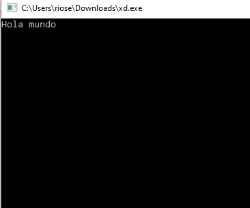
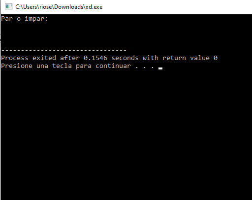
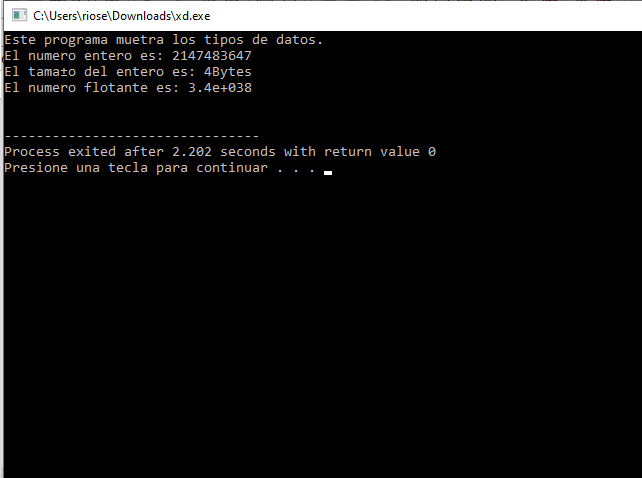
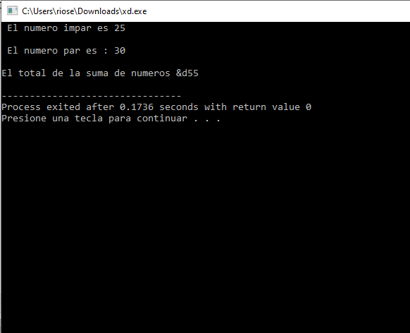
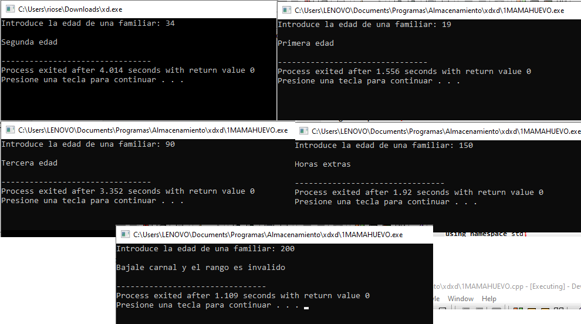

# Programas de la unidad 1


* [01_Hola.cpp](https://github.com/up210710/UP210710_CPP/blob/main/U1%20Programming%20Introduction/01_Hola.cpp)
*  Objetivo
### El objetivo de este programa es que se imprima hola en la ventana de ejecuccion.
```
#include <iostream>
#include <conio.h>
#include <stdio.h>
using namespace std;
int main()
{
    char pausa;
    cout << "Hola mundo";
    pausa = getchar();
    return 0;
}
```
<div align="center">

</div>

* [02_parimpar.cpp](https://github.com/up210710/UP210710_CPP/blob/main/U1%20Programming%20Introduction/02_parimpar.cpp)
* Objetivo
### El objetivo de este programa es que se presente o imprima el par o impar en la ventana de ejecuccion.
```
#include <iostream>
using namespace std;
int main()
{
    cout << "Par o impar: " << endl
         << "\n"
         << endl;
    return 0;
}
```
<div align="center">

</div>

* [03_tiposdedatos.cpp](https://github.com/up210710/UP210710_CPP/blob/main/U1%20Programming%20Introduction/03_tiposdedatos.cpp)
* Objetivo
### El objetivo de este programa es que se presente o imprima los datos introducidos en este programa  en la ventana de ejecuccion.
```
/*
    Unidad 1. Tipos de datos
    Autor: Juan Manuel Rios Estrada
    Fecha: 15/09/2022
    Descripcion: Muestra los diferentes tipos de datos en c++
    */

// Libreria para manejo de entradas y salida de pantalla
#include <iostream>
// Libreria para el uso de printf y scanf
#include <stdio.h>

// uso del manejo para evitar el std
using namespace std;
// funcion principal del tipo entero
int main()
{
    // mas informacion en:
    //*********************
    int entero = 2147483647;
    float flotante = 3.4e38;
    double grande = 2.565465654654;
    char caracter = '@';

    cout << "Este programa muetra los tipos de datos. \n";
    cout << "El numero entero es: " << entero << endl;
    cout << "El tamaño del entero es: " << sizeof(entero) << "Bytes" << endl;
    cout << "El numero flotante es: " << flotante << endl;
    getchar();
    return 0;
}

```
<div align="center">

</div>

* [04_Ciclo.cpp](https://github.com/up210710/UP210710_CPP/blob/main/U1%20Programming%20Introduction/04_Ciclos.cpp)
* Objetivo
### El objetivo de este programa es que se tome los datos de suma y numero y los imprima lo que se quiere determinar si es numero impar o par en la ventana de ejecucion.
```
#include <iostream>
using namespace std;
int main()
{
    int n = 10, suma = 0, suma1 = 0;
    for (int i = 1; i <= n; i++)
    {
        if (i % 2 == 0)
        {
            suma += i;
        }
        else
        {
            suma1 += i;
        }
    }
    printf(" El numero impar es %d \n", suma1);
    cout << endl;
    printf(" El numero par es : %d \n", suma);
    cout << endl;
    cout << "El total de la suma de numeros &d" << suma1 + suma;
    cout << endl;
    return 0;
}
```
<div align="center">

</div>

* [05_Ejercicio_Edad.cpp](https://github.com/up210710/UP210710_CPP/blob/main/U1%20Programming%20Introduction/05_Ejercicio_Edad.cpp)
* Objetivo
### El objetivo de este programa es que se impriman los distintos resultados de este ejercicio de edades como la 1ra edad, 2da edad, 3ra edad y horas extra que se termina que la edad mayor a 150 años es mucho mayor de los normal que se ejecutara en la ventana del mismo.
```
/*
    Unidad 1. Ejericio De Las Edades
    Autor: Juan Manuel Rios Estrada
    Fecha: 27/09/2022
    Objetivo: Definir la etapa de la persona
              [1...150] Validacion
              [1...30 ] 1ra Edad
              [31...60] 2da Edad
              [61...90] 3ra Edad
              [91...  ] Horas extras
*/

#include <iostream>
using namespace std;
int main()
{
    int E;
    cout << "Introduce la edad de una familiar: ";
    cin >> E;
    cout << endl;
    if (E > 0 && E <= 150)
    {
        if (E <= 30)
        {
            cout << "Primera edad " << endl;
        }
        else if (E >= 31 && E <= 60)
        {
            cout << "Segunda edad " << endl;
        }
        else if (E >= 61 && E <= 90)
        {
            cout << "Tercera edad " << endl;
        }
        else
        {
            cout << "Horas extras " << endl;
        }
    }
    else
    {
        cout << "Bajale carnal y el rango es invalido" << endl;
    }
    getchar();
    return 0;
}
```
<div align="center">

</div>

