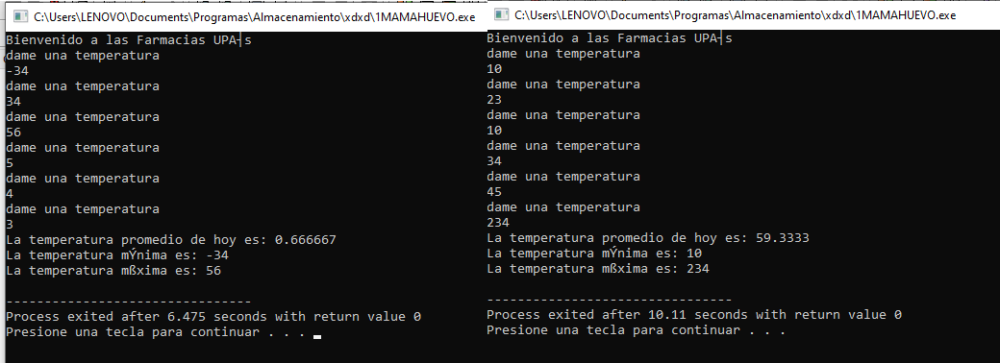

<div align="center">

</div>

# Programas de la unidad 2

* [01_abc.cpp](https://github.com/up210710/UP210710_CPP/blob/main/U2%20Control%20Structures%20and%20Cycles/01_abc.cpp)
* Objetivo
### El objetivo de este programa es que se impriman el abecedario en mayusculas y en minusculas y es sus formas descendentes en los diferentes ciclos como el for, while, do while de la ejecuccion de la misma ventana.
```
// Objetivo: Imprimir el abecedario
// Abecedario en minuscula
#include <iostream>
using namespace std;
int main()
{
    char letra1 = 'a'; // Letra = 'a'
    char letra2 = 90;  // Letra = 'A'
    char letra3 = 65;  // Letra = 'A'
    cout << "Abecedario en minusculas" << endl;
    for (int i = 0; i < 26; i++)
    {
        cout << letra1 << "\t";
        letra1 = letra1 + 1;
    }
    cout << endl;
    cout << "Abecedario en minusculas al reves" << endl;
    for (int i = 0; i < 26; i++)
    {
        cout << letra1 << "\t";
        letra1 = letra1 - 1;
    }
    cout << "Numeros descendentes: " << endl;
    for (int i = 10; i > 0; i--)
    {
        cout << i << "\t" << endl;
    }
    cout << "Abecedeario al reves: " << endl;
    for (int i = 0; i < 26; i++)
    {
        cout << letra2 << "\t";
        letra2 = letra2 - 1;
    }
    cout << endl;
    cout << "Abecedeario normal: " << endl;
    for (int i = 0; i < 26; i++)
    {
        cout << letra3 << "\t";
        letra3 = letra3 + 1;
    }
    getchar();
    return 0;
}
```
<div align="center">

</div>

* [02_tramo.cpp](https://github.com/up210710/UP210710_CPP/blob/main/U2%20Control%20Structures%20and%20Cycles/02_tramo.cpp)
* Objetivo
### El objetivo de este programa es que se impriman el resultado de la renta con su respectivo impuesto de mismo pais con los diferentes tipos de impuestos de la ejecuccion de la misma ventana.
```
/*
    Unidad 2. Ejericio De Las Edades
    Autor: Juan Manuel Rios Estrada
    Fecha: 27/09/2022
    Objetivo: Definir los tramos para la declaracion
              [1...10000    ] Impuesto 5%
              [10000...20000] Impuesto 15%
              [20000...35000] Impuesto 20%
              [35000...60000] Impuesto 30%
              [60000...     ] Impuesto 45%
*/

#include <iostream>
using namespace std;
int main()
{
    int Renta;
    float Impuesto, IcLr,Total;
    cout << "Introduce la cantidad de pago de la renta: ";
    cin >> Renta;
    cout << endl;
    if (Renta < 10000)
    {
        cout << "El impuesto total es del 5 %" << endl;
        Impuesto = 0.5;
    }
    else if (Renta >= 10000 && Renta < 20000)
    {
        cout << "El impuesto total es del 15 %" << endl;
        Impuesto = 0.15;
    }
    else if (Renta >= 20000 && Renta < 35000)
    {
        cout << "El impuesto total es del 20 %" << endl;
        Impuesto = 0.20;
    }
    else if (Renta >= 35000 && Renta < 60000)
    {
        cout << "El impuesto total es del 30 %" << endl;
        Impuesto = 0.30;
    }
    else if (Renta >= 60000)
    {
        cout << "El impuesto total es del 45 %" << endl;
        Impuesto = 0.45;
    }
    IcLr=Renta*Impuesto;
    Total=Renta-IcLr;
    cout << "El dinero de la renta con el impuesto es: " << Total<< endl;
    cout << "El impuesto aplicado es de: " << Renta * Impuesto << endl;
    getchar();
    return 0;
}
```
<div align="center">

</div>

* [03_Tablas.cpp](https://github.com/up210710/UP210710_CPP/blob/main/U2%20Control%20Structures%20and%20Cycles/03_Tablas.cpp)
* Objetivo
### El objetivo de este programa es que se impriman el resultado de la variable llamada N que es el numero principal que hace que funcione todo pero el objetivo es ejecutar o imprimir las tablas de multiplicar del mismo numero dado asi como en orden descendente y normal con los diferentes ciclos(Opcional cualquier tipo de ciclo) de la ejecuccion de la misma ventana.
```
#include <iostream>
using namespace std;
int main()
{
    int N, o, p = 1;
    cout << "Introduce el numero que quieres conocer su tabla de multiplicar: ";
    cin >> N;
    cout << "hasta que numero quieres la multiplicacion: ";
    cin >> o;

    cout << "Tabla de multiplicar de forma normal: " << endl;
    for (int i = 1; i <= o; i++)
    {
        cout << N << " X " << i << " = " << i * N << endl;
    }
    cout << "Tabla de multiplicar de forma descendentes: " << endl;
    for (int i = o; i > 0; i--)
    {
        cout << N << " X " << i << " = " << i * N << endl;
    }
    int j = 1;
    cout << "Tabla de multiplicar de forma normal con el while: " << endl;
    while (j <= o)
    {
        cout << N << " X " << j << " = " << j * N << endl;
        j++;
    }
    cout << "Tabla de multiplicar de forma descendentes con el while: " << endl;
    while (j > 0)
    {
        cout << N << " X " << j << " = " << j * N << endl;
        j--;
    }
    cout << "Tabla de multiplicar de forma normal con el do while: " << endl;
    do
    {
        cout << N << " X " << p << " = " << p * N << endl;
        p++;
    } while (p <= o);
    cout << "Tabla de multiplicar de forma descendentes con el do while: " << endl;
    do
    {
        cout << N << " X " << p << " = " << p * N << endl;
        p--;
    } while (p > 0);
    return 0;
}

```
<div align="center">

</div>

* [06_Puntos.cpp](https://github.com/up210710/UP210710_CPP/blob/main/U2%20Control%20Structures%20and%20Cycles/06_Puntos.cpp)
* Objetivo
### El objetivo de este programa es que se impriman el resultado de una determinada empresa que sus empleados son evaluados al final de cada año y quiere obtener en la evaluación es que comienze en 0.0 y pueden ir aumentando, traduciéndose en mejores beneficios. Los puntos que pueden conseguir los empleadospueden ser 0.0, 0.4, 0.6 o más, pero no valores intermedios entre las cifras mencionadas. A continuación se muestra una tabla con los niveles correspondientes a cada puntuación que se vera el resultado en el mismo programa.
```
/*
Date: 07/10/2022
Author: Juan Manuel Rios Estrada
Email: up210710@alumnos.upa.edu.mx
Description: Puntuacion de usuario y bono
Last Modification: 09/10/2022
*/
#include <iostream>
#include <ctype.h>

using namespace std;

int main()
{
    double punto;
    double monto = 2400;
    double beneficio = 0;

    cout << "Cuál es la puntuación del usuario? ";
    cin >> punto;
    if (punto == 0.0)
    {
        cout << "Su nivel es Inaceptable \n";
        beneficio = monto * punto;
        cout << "tu beneficio es: $" << beneficio << endl;
    }
    else if (punto == 0.4)
    {
        cout << "Su nivel es aceptable  \n";
        beneficio = monto * punto;
        cout << "tu beneficio es: $" << beneficio << endl;
    }
    else if (punto > 1)
    {
        cout << "Introduce una puntuación válida" << endl;
    }
    else if (punto >= 0.6)
    {
        cout << "Tu nivel de Mérito es \n";
        beneficio = monto * punto;
        cout << "tu beneficio es: $" << beneficio << endl;
    }
    else
    {
        cout << "Introduce una puntuación válida" << endl;
    }
    return 0;
}
```
<div align="center">

</div>

* [07_Juegos.cpp](https://github.com/up210710/UP210710_CPP/blob/main/U2%20Control%20Structures%20and%20Cycles/07_Juegos.cpp)
* Objetivo
### El objetivo de este programa es que se impriman el resultado de una quiere calcular de forma automática el precio que debe cobrar a sus clientes por entrar. El programa debe preguntar al usuario la edad del cliente y mostrar el precio de la entrada. Si el cliente es menor de 4 años puede entrar gratis, si tiene entre 4 y 18 años debe pagar $5 y si es mayor de 18 se vera el resultado en el mismo programa.
```
/*
Date: 07/10/2022
Author: Juan Manuel Rios Estrada
Email: up210710@alumnos.upa.edu.mx
Description: pase para juegos
Last Modification: 09/10/2022
*/
#include <iostream>
using namespace std;

int main()
{
    int edad;
    int precio;
    cout << "Cuantos años tienes ";
    cin >> edad;
    if (edad < 4)
        precio = 0;
    else if (edad >= 4 && edad <= 18)
        precio = 5;
    else if (edad > 18)
        precio = 10;
    cout << "Tienes que pagar: $" << precio << endl;
    cout << "Bienvenidos a los Juegos de Los Pollos Hermanos" << endl;
    return 0;
}
```
<div align="center">

</div>

* [08_Pizza.cpp](https://github.com/up210710/UP210710_CPP/blob/main/U2%20Control%20Structures%20and%20Cycles/08_Pizza.cpp)
* Objetivo
### El objetivo de este programa es que se impriman el resultado de una quiere el menu de una pizzería Bella Napoli ofrece pizzas vegetarianas y no vegetarianas a sus clientes. Los ingredientes para cada tipo de pizza que son Ingredientes vegetarianos: Pimiento y tofu.  Ingredientes no vegetarianos: Peperoni, Jamón y asi crear un menu que el usuario pueda escoger su propia pizza resultado en el mismo programa.
```
/*
Date: 07/10/2022
Author: Juan Manuel Rios Estrada
Email: up210710@alumnos.upa.edu.mx
Description: Pizza vegetariana y no vegetariana
Last Modification: 09/10/2022
*/
#include <iostream>
using namespace std;
int main()
{

    int pizza;
    int typo;
    int ingredientes = 0;
    cout << "que tipo de pizza quieres \n";
    cout << "Elige con 1 y 2 \n";
    cout << "pizza vegetariana es 1 \n";
    cout << "La pizza normal es 2 \n";
    cin >> typo;
    if (typo == 1)
    {
        cout << "Seleccionas una Pizza Vegetariana \n";
        cout << "Elige un ingrediente \n";
        cout << "Puedes elegir pimienta o tofu \n";
        cout << "Elige con 1 y 2 \n";
        cout << "la pimienta es 1 \n";
        cout << "El Tofu es el 2 \n";
        cin >> ingredientes;
        if (ingredientes == 1)
        {
            cout << "tu eliges la pimienta \n";
            cout << "Y tu pizza incluye Pimienta, Queso de Soja y Salsa de Tomate \n";
            cout << "\n";
        }
        else if (ingredientes == 2)
        {
            cout << "tu eliges el Tofu \n";
            cout << "Y tu pizza incluye Tofu, Queso de Soja y Salsa de Tomate \n";
            cout << "\n";
        }
    }
    if (typo == 2)
    {
        cout << "Seleccionas una Pizza Normal \n";
        cout << "Elige un ingrediente \n";
        cout << "Puedes elegir pepperoni, jamón o salmón\n";
        cout << "EL Pepperoni es el 1 \n";
        cout << "El jamon es el 2 \n";
        cout << "El Salmon es el 3 \n";
        cout << "\n";
        cin >> ingredientes;
        if (ingredientes == 1)
        {
            cout << "Tu eliges el pepperoni \n";
            cout << "Y tu pizza incluye pepperoni, mozarella y salsa de tomate \n";
            cout << "\n";
        }
        else if (ingredientes == 2)
        {
            cout << "Tu eliges el jamon \n";
            cout << "Y tu pizza incluye jamón, mozarella y salsa de tomate \n";
            cout << "\n";
        }
        else if (ingredientes == 3)
        {
            cout << "Tu eliges el salmon \n";
            cout << "Y tu pizza incluye salmón, mozarella y salsa de tomate \n";
            cout << "\n";
        }
    }
    cout << "tu pizza estará lista en menos de lo que canta un águila \n";
    cout << "GRACIAS POR visitar Box Pizzas ";
    cout << "\n";
    cout << "\n";
    cout << "\n";
    return 0;
}
```
<div align="center">

</div>

* [09_Temperatura.cpp](https://github.com/up210710/UP210710_CPP/blob/main/U2%20Control%20Structures%20and%20Cycles/09_Temperatura.cpp)
* Objetivo
### El objetivo de este programa es que se impriman el resultado del programa en el que se ingresen 6 temperaturas y determine el promedio, la mas baja y la mas alta se vera el resultado en el mismo programa.
```
/*
Date: 07/10/2022
Author: Juan Manuel Rios Estrada
Email: up210710@alumnos.upa.edu.mx
Description: Temperatura
Last Modification: 09/10/2022
*/
#include <iostream>
using namespace std;
int main()
{
    float temperatura;
    int contador = 1;
    float tempeAcum = 0;
    int temperatura_min = 9999, temperatura_max = -9999;
    cout << "Bienvenido a las Farmacias UPA´s \n";
    do
    {
        cout << "dame una temperatura" << endl;
        cin >> temperatura;
        tempeAcum += temperatura;

        contador++;
        if (temperatura <= temperatura_min)
        {
            temperatura_min = temperatura;
        }
        if (temperatura >= temperatura_max)
        {
            temperatura_max = temperatura;
        }
    } while (contador <= 6);
    cout << "La temperatura promedio de hoy es: " << tempeAcum / 6 << endl;
    cout << "La temperatura mínima es: " << temperatura_min << endl;
    cout << "La temperatura máxima es: " << temperatura_max << endl;
    return 0;
}
```
<div align="center">

</div>

* [10_Precios.cpp](https://github.com/up210710/UP210710_CPP/blob/main/U2%20Control%20Structures%20and%20Cycles/10_Precios.cpp)
* Objetivo
### El objetivo de este programa es que se impriman el resultado del programa que lea indefinidamente cantidades de productos y su precio, y al final indique el total de la factura, Para saber que se ha terminado con la compra, se deberá ingresar un 0 en la cantidad y se vera el resultado en el mismo programa.
```
/*
Date: 09/10/2022
Author: Juan Manuel Rios Estrada
Email: up210710@alumnos.upa.edu.mx
Description: Calcular el precio de una compra.
Last Modification: 09/10/2022
*/
#include <iostream>
using namespace std;
int main()
{

    int producto;
    float precio;
    float calculo = 0;
    float total = 0;
    int vuelta;

    cout << "Bienvenido al oxxo \n";

    do
    {
        cout << "Dame la cantidad de productos \n";
        cin >> producto;

        if (producto != 0 and producto > 0)
        {

            cout << "Dime el precio del producto. \n";
            cin >> precio;

            total += (precio * producto);
        }

    } while (producto != 0);

    cout << "El total de tu compra es: \n"
         << total << endl;

    return 0;
}
```
<div align="center">

</div>

* [11_BintoDecim.cpp](https://github.com/up210710/UP210710_CPP/blob/main/U2%20Control%20Structures%20and%20Cycles/11_BintoDecim.cpp)
* Objetivo
### El objetivo de este programa es que se impriman el resultado del un programa que realice la conversión de binario a decimal, solo para números enteros mayores a 0. El resultado puede ser mostrado mediante una variable entera o en un conjunto de caracteres y se vera el resultado en el mismo programa.
```
/*
Date: 09/10/2022
Author: Juan Manuel Rios Estrada
Email: up210710@alumnos.upa.edu.mx
Description: conversión de binario a decimal
Last Modification: 09/10/2022
*/

#include <iostream>
#include <cmath>
using namespace std;
int main()
{
    int exp,digito;
    double binario, decimal;
   cout << "Introduce numero: ";
   cin >> binario;
   exp=0;
   decimal=0;
   while(((int)(binario/10))!=0)
   {
           digito = (int)binario % 10;
           decimal = decimal + digito * pow(2.0,exp);
           exp++;
           binario=(int)(binario/10);
   }
   decimal=decimal + binario * pow(2.0,exp);
   cout << endl << "Decimal: " << decimal << endl;
    
    return 0;
}
```
<div align="center">

</div>
# These are the exercises done in class
<center> Hola     

Bienvenido a la programacion 
</center>

# H1 Linea de encabezado 
**Texto en negritas**

__texto en negritas__

*Texto en cursiva*
> Cita de elementos 
---
***
___
1. Leer
2. Escribir
3. Ejecutar
   
<ol>
<li>Read</li>
<li>Write</li>
<li>Execute</li>
</ol>

* Primer elemento
* Segundo elemento
- Tercer elemento 
---


```
#include <iostream>
using namespace std;
int main()
{
    int E;
    cout << "Introduce la edad de una familiar: ";
    cin >> E;
    cout << endl;
    if (E > 0 && E <= 150)
    {
        if (E <= 30)
        {
            cout << "Primera edad " << endl;
        }
        else if (E >= 31 && E <= 60)
        {
            cout << "Segunda edad " << endl;
        }
        else if (E >= 61 && E <= 90)
        {
            cout << "Tercera edad " << endl;
        }
        else
        {
            cout << "Horas extras " << endl;
        }
    }
    else
    {
        cout << "Bajale carnal y el rango es invalido" << endl;
    }
    getchar();
    return 0;
}
```


<div align="center">

</div>

<div align="center">

</div>


## Tabla 
| Color | Codigo  |
| ----- | ------  |
| Rojo  | #FF0000 |
| Azul  | #cb3234 |

`https://www.google.com.mx`     
https://www.google.com.mx
>[MSN](https://www.google.com.mx/search?q=lluvia+de+hamburguesas+meme+policia&tbm=isch&hl=es-419&chips=q:lluvia+de+hamburguesas+meme+policia,online_chips:gif:TTYYAnxPX9I%3D&sa=X&ved=2ahUKEwjgpoHi0br6AhVqlWoFHQrlCCgQ4lYoAHoECAEQJA&biw=1733&bih=876#imgrc=Wv69Fg85VQ283M)

<a href="https://www.google.com.mx/search?q=lluvia+de+hamburguesas+meme+policia&tbm=isch&hl=es-419&chips=q:lluvia+de+hamburguesas+meme+policia,online_chips:gif:TTYYAnxPX9I%3D&sa=X&ved=2ahUKEwjgpoHi0br6AhVqlWoFHQrlCCgQ4lYoAHoECAEQJA&biw=1733&bih=876#imgrc=Wv69Fg85VQ283M">
https://www.google.com.mx/search?q=lluvia+de+hamburguesas+meme+policia&tbm=isch&hl=es-419&chips=q:lluvia+de+hamburguesas+meme+policia,online_chips:gif:TTYYAnxPX9I%3D&sa=X&ved=2ahUKEwjgpoHi0br6AhVqlWoFHQrlCCgQ4lYoAHoECAEQJA&biw=1733&bih=876#imgrc=Wv69Fg85VQ283M
</a>
