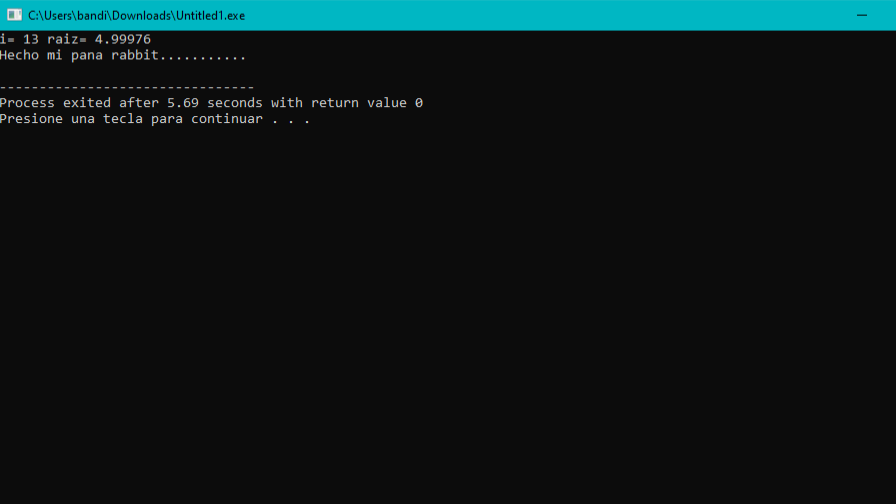

<div align="center">

</div>

# Unit 3 programs

* [E01_Funcionbiseciones.cpp](https://github.com/up210710/UP210710_CPP/blob/main/U3%20Fuctions/E01_Funcionbiseciones.cpp)
* Objetivo
### Debe de interar en base a un margen de error establecido.
```
#include <iostream>
#include <cmath>
using namespace std;

double funcionEc1(double x) // x^2-8x+15
{
    return (pow(x, 2) - 8 * x + 15);
}
int main()
{
    double x1 = 4;
    double x2 = 7;
    double xNueva;
    double Es = .001;         // Error Estandar o Error Absoluto
    double Er = abs(x2 - x1); // Errror Relativo
    int i = 1;
    while (Er > Es)
    {
        xNueva = (x1 + x2) / 2;
        if (funcionEc1(x1) * funcionEc1(xNueva) < 0)
        {
            x2 = xNueva;
        }
        else
        {
            x1 = xNueva;
        }
        Er = abs(x2 - x1);
        i = i + 1;
    }
    cout << "i= " << i << " raiz= " << xNueva << endl;
    cout << "Hecho mi pana rabbit..........." << endl;
    return 0;
}
```
<div align="center">

</div>

* [02_tramo.cpp](https://github.com/up210710/UP210710_CPP/blob/main/U2%20Control%20Structures%20and%20Cycles/02_tramo.cpp)
* Objetivo
### El objetivo de este programa es que se impriman el resultado de la renta con su respectivo impuesto de mismo pais con los diferentes tipos de impuestos de la ejecuccion de la misma ventana.
```

```
<div align="center">

</div>

* [03_Tablas.cpp](https://github.com/up210710/UP210710_CPP/blob/main/U2%20Control%20Structures%20and%20Cycles/03_Tablas.cpp)
* Objetivo
### El objetivo de este programa es que se impriman el resultado de la variable llamada N que es el numero principal que hace que funcione todo pero el objetivo es ejecutar o imprimir las tablas de multiplicar del mismo numero dado asi como en orden descendente y normal con los diferentes ciclos(Opcional cualquier tipo de ciclo) de la ejecuccion de la misma ventana.
```

```
<div align="center">

</div>

* [06_Puntos.cpp](https://github.com/up210710/UP210710_CPP/blob/main/U2%20Control%20Structures%20and%20Cycles/06_Puntos.cpp)
* Objetivo
### El objetivo de este programa es que se impriman el resultado de una determinada empresa que sus empleados son evaluados al final de cada año y quiere obtener en la evaluación es que comienze en 0.0 y pueden ir aumentando, traduciéndose en mejores beneficios. Los puntos que pueden conseguir los empleadospueden ser 0.0, 0.4, 0.6 o más, pero no valores intermedios entre las cifras mencionadas. A continuación se muestra una tabla con los niveles correspondientes a cada puntuación que se vera el resultado en el mismo programa.
```

```
<div align="center">

</div>

* [07_Juegos.cpp](https://github.com/up210710/UP210710_CPP/blob/main/U2%20Control%20Structures%20and%20Cycles/07_Juegos.cpp)
* Objetivo
### El objetivo de este programa es que se impriman el resultado de una quiere calcular de forma automática el precio que debe cobrar a sus clientes por entrar. El programa debe preguntar al usuario la edad del cliente y mostrar el precio de la entrada. Si el cliente es menor de 4 años puede entrar gratis, si tiene entre 4 y 18 años debe pagar $5 y si es mayor de 18 se vera el resultado en el mismo programa.
```
```
<div align="center">

</div>

* [08_Pizza.cpp](https://github.com/up210710/UP210710_CPP/blob/main/U2%20Control%20Structures%20and%20Cycles/08_Pizza.cpp)
* Objetivo
### El objetivo de este programa es que se impriman el resultado de una quiere el menu de una pizzería Bella Napoli ofrece pizzas vegetarianas y no vegetarianas a sus clientes. Los ingredientes para cada tipo de pizza que son Ingredientes vegetarianos: Pimiento y tofu.  Ingredientes no vegetarianos: Peperoni, Jamón y asi crear un menu que el usuario pueda escoger su propia pizza resultado en el mismo programa.
```
```
<div align="center">

</div>

* [09_Temperatura.cpp](https://github.com/up210710/UP210710_CPP/blob/main/U2%20Control%20Structures%20and%20Cycles/09_Temperatura.cpp)
* Objetivo
### El objetivo de este programa es que se impriman el resultado del programa en el que se ingresen 6 temperaturas y determine el promedio, la mas baja y la mas alta se vera el resultado en el mismo programa.
```
```
<div align="center">

</div>

* [10_Precios.cpp](https://github.com/up210710/UP210710_CPP/blob/main/U2%20Control%20Structures%20and%20Cycles/10_Precios.cpp)
* Objetivo
### El objetivo de este programa es que se impriman el resultado del programa que lea indefinidamente cantidades de productos y su precio, y al final indique el total de la factura, Para saber que se ha terminado con la compra, se deberá ingresar un 0 en la cantidad y se vera el resultado en el mismo programa.
```
```
<div align="center">

</div>

* [11_BintoDecim.cpp](https://github.com/up210710/UP210710_CPP/blob/main/U2%20Control%20Structures%20and%20Cycles/11_BintoDecim.cpp)
* Objetivo
### El objetivo de este programa es que se impriman el resultado del un programa que realice la conversión de binario a decimal, solo para números enteros mayores a 0. El resultado puede ser mostrado mediante una variable entera o en un conjunto de caracteres y se vera el resultado en el mismo programa.
```
```
<div align="center">

</div>