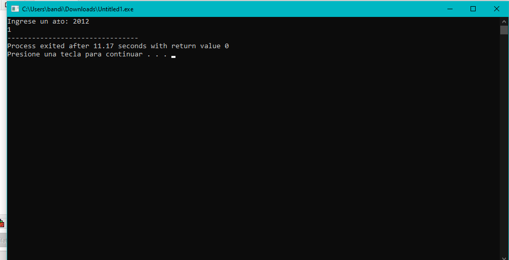
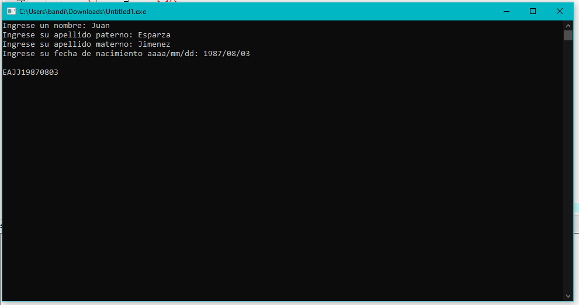
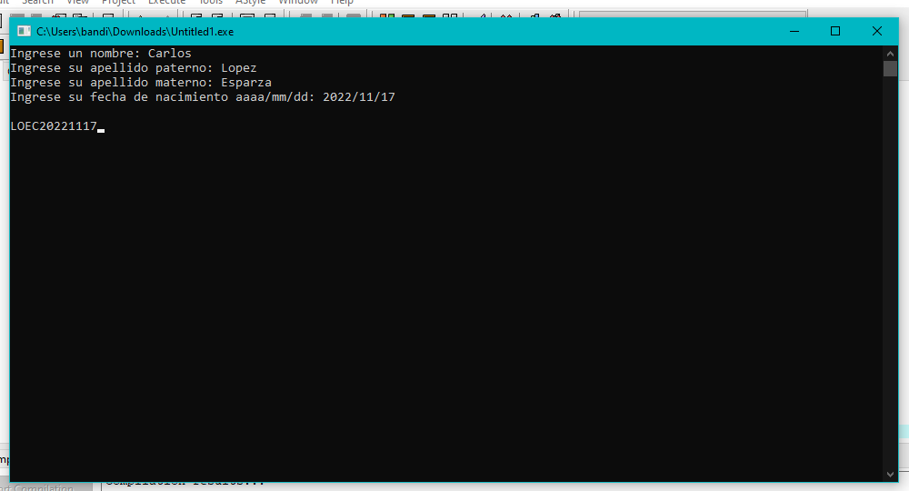
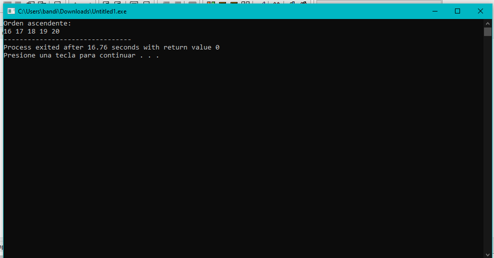
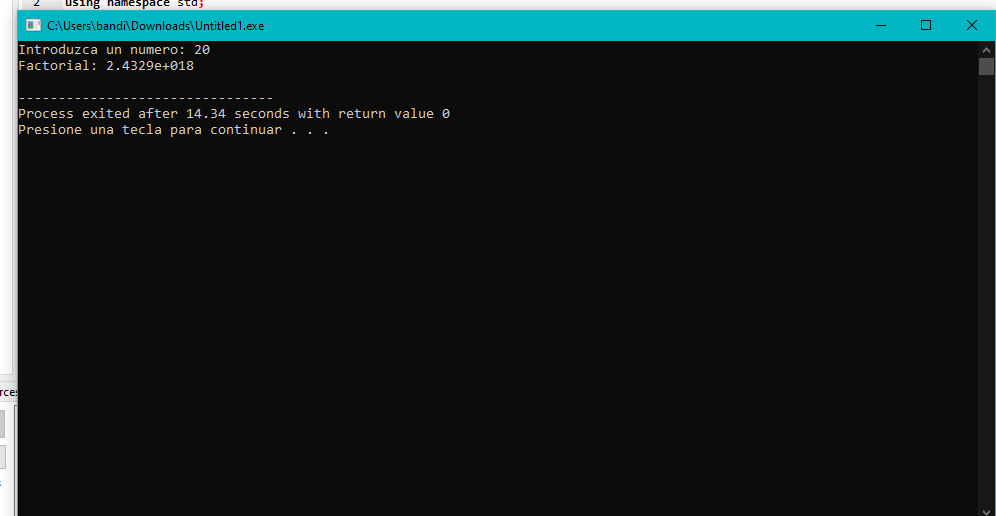

# Unit 3 programs

## Functions 

<div align="center">

</div>

* [E01_Funcionbiseciones.cpp](https://github.com/up210710/UP210710_CPP/blob/main/U3%20Fuctions/E01_Funcionbiseciones.cpp)
* Objetiv
### It must be based on an established margin of error.
```
#include <iostream>
#include <cmath>
using namespace std;

double funcionEc1(double x) // x^2-8x+15
{
    return (pow(x, 2) - 8 * x + 15);
}
int main()
{
    double x1 = 4;
    double x2 = 7;
    double xNueva;
    double Es = .001;         // Error Estandar o Error Absoluto
    double Er = abs(x2 - x1); // Errror Relativo
    int i = 1;
    while (Er > Es)
    {
        xNueva = (x1 + x2) / 2;
        if (funcionEc1(x1) * funcionEc1(xNueva) < 0)
        {
            x2 = xNueva;
        }
        else
        {
            x1 = xNueva;
        }
        Er = abs(x2 - x1);
        i = i + 1;
    }
    cout << "i= " << i << " raiz= " << xNueva << endl;
    cout << "Hecho mi pana rabbit..........." << endl;
    return 0;
}
```
<div align="center">

</div>

* [E02_Añobisiesto.cpp]()
* Objetiv
### The objective of this program is that from the year 2012 it returns when it is affirmative it returns 1 and otherwise 0.
```
#include <iostream>
#include <conio.h>
using namespace std;

int esbisiesto(int);
int main(){

	int year;
	
	cout<<"Ingrese un año: ";
	cin>>year;

	cout<<esbisiesto(year);
	
	getch();
	return 0;
}


int esbisiesto(int year){
	
	int bisiesto = 0;
	if(year%400==0 || (year%4==0 && year%100!=0)){
		bisiesto = 1;
	}
	return bisiesto;
}
```
<div align="center">

</div>

* [E03_Coseno.cpp]()
* Objetiv
### The objective of this program is the cosine value of a specific angle will be given.
```
#include <iostream>
#include <math.h>
using namespace std;

#define n 6
#define PI 3.1416

long double fact(int num)
{
    long double p= 1.0;
    for (int i = 1; i <= num; i++)
    {
        p *= i;
    }
    return p;
}

double rad(double grd)
{
    return grd * PI / 180;
}

double cos(double x)
{
    double resultado = 0;
    for (int i = 0; i <= n; i++)
    {
        resultado = resultado + (pow(-1, i)*((pow(x, 2 * i)) / fact(2 * i)));
    }
    return resultado;
}
int main()
{
    double angulo = rad(60), print;
    print = cos(angulo);
    cout << "Coseno de 60 igual a  " << print << endl;
    return 0;
}
```
<div align="center">

</div>

* [04_desviacionestandar.cpp](https://github.com/up210710/UP210710_CPP/blob/main/U3%20Fuctions/desviacionestandar.cpp)
* Objetiv
### The objective of this program is that at the moment of inserting the data you get the mean and with it and the formula get the standard deviation of the population and the sample
```
#include <iostream>
#include <math.h>
#include <conio.h>
using namespace std;


void desv(float );

int main(){
	float n;
	cout<<"Ingrese su numero de datos: ";cin>>n;
	
	desv(n);
	
	getch();
	return 0;
}

void desv(float n){
	
	float va = 0, prom = 0, suma = 0, s = 0, dv = 0;
	
	
	float datos[100];
	
	for(int i = 0; i < n; i++){
		
		cout<<"Ingrese sus datos: ";cin>>datos[i];
        cout<<endl;
	}


	for (int i = 0; i < n; i++)
	{
		s = s + datos[i];
	}
	
	prom = s/n;
	for (int i = 0; i < n; i++)
	{
		 suma = suma + (pow((datos[i] - prom),2));
		 
	}
	
	
	va = suma/(n-1);
	dv = sqrt(va);
	
	
	cout<<"\nDesviación estándar muestra: "<<dv;
	va = suma/(n);
	dv = sqrt(va);
	cout<<"\nDesviación estándar poblacional: "<<dv;
}
```
<div align="center">

</div>

<div align="center">

</div>


* [E5_monedas.cpp](https://github.com/up210710/UP210710_CPP/blob/main/U3%20Fuctions/E08_monedas.cpp)
* Objetiv
### The objective of this program is that at the moment of putting an amount of money it is in coins or bills of 1000,500,200,100,50,20,10,5,2 and finally 1.
```
#include <iostream>

using namespace std;

void obtenerCambio(int); //cambio - monto
void obtenerMonedas(int);
void imprimirCambio();

//variables globales 
int mil = 0, quinientos = 0, doscientos = 0, cien = 0;
int cincuenta = 0, veinte = 0;
int diez = 0, cinco = 0, dos = 0, uno = 0;
int resi; 

int main(){

    int dinero; 

    cout << "Dame la cantidad de dinero: ";
    cin >> dinero;
    cout << "\n"; 
    
    obtenerCambio(dinero);
    imprimirCambio();

    cout << endl; 
    return 0;
}

void obtenerMonedas(int dinero){

    diez = resi/10;
    resi = resi%10;
    cinco = resi/5;
    resi = resi%5;
    dos = resi/2;
    resi = resi%2;
    uno = resi/1;
    resi = resi%1;
}

void obtenerCambio(int dinero){
    mil=dinero/1000;
    resi = dinero%1000;
    quinientos = resi/500;
    resi = resi%500;
    doscientos = resi/200;
    resi = resi%200;
    cien = resi/100;
    resi = resi%100;
    cincuenta = resi/50;
    resi = resi%50;
    veinte = resi/20;
    resi = resi%20;

    obtenerMonedas(resi);
}

void imprimirCambio(){

    cout << "Tu cambio es: " << "\n"; 
    cout << "Billetes de $1000: \n" << mil << "\n";
    cout << "Billetes de $500: \n" << quinientos << "\n";
    cout << "Billetes de $200: \n" << doscientos << "\n";
    cout << "Billetes de $100: \n" << cien << "\n"; 
    cout << "Billetes de $50: \n" << cincuenta << "\n";
    cout << "Billetes de $20: \n" << veinte << "\n"; 
    cout << "Monedas de $10: \n" << diez << "\n";
    cout << "Monedas de $5: \n" << cinco << "\n";
    cout << "Monedas de $2: \n" << dos << "\n";
    cout << "Monedas de $1: \n" << uno << "\n"; 
}
```
<div align="center">

</div>

* [E06_Romanos.cpp](https://github.com/up210710/UP210710_CPP/blob/main/U3%20Fuctions/E09_Romanos.cpp)
* Objetiv
### The objective of this program is to convert Arabic numerals to Roman numerals.
```
#include <iostream>
#include <cstring>
using namespace std;

int main()
{
    int valor[] = {1000, 900, 500, 400, 100, 90, 50, 40, 10, 9, 5, 4, 1};
    string simbolo[] = {"M","CM","D","CD","C","XC","L","XL","X","IX","V","IV","I"}
          ,resultado="";
    int num,i=0;
    cout<<"Numero: ";
    cin>>num;
    if(num>=1 && num<=4000)
    {
        int temp = num;
        while(temp > 0)
        {
            while(temp >= valor[i])
            {
                resultado += simbolo[i];
                temp -= valor[i];
            }
            i++;
        }
        cout<<"Resultado: "<<resultado<<endl;
    }
    return 0;
}
```
<div align="center">

</div>

* [07_RFC.cpp](https://github.com/up210710/UP210710_CPP/blob/main/U3%20Fuctions/Rfc.cpp)
* Objetivo
### The objective of this program is that when entering the name and the paternal and maternal surnames with the date of birth with these, the rfc will be created as a code that will be attached to the form that the rfc normally have.
```
#include <iostream>
#include <conio.h>
#include <string.h>
using namespace std;

void RFC(char nombre[], char apellido_paterno[], char apellido_materno[],char fecha[], int);

int main(){
	const int TAM = 30;
	char nombre[TAM], apellido_paterno[TAM], apellido_materno[TAM], fecha[TAM];
	
	
	
	cout<<"Ingrese un nombre: ";
	cin.getline(nombre,TAM,'\n');
	cout<<"Ingrese su apellido paterno: ";
	cin.getline(apellido_paterno,TAM,'\n');
	cout<<"Ingrese su apellido materno: ";
	cin.getline(apellido_materno,TAM,'\n');
	cout<<"Ingrese su fecha de nacimiento aaaa/mm/dd: ";
	cin.getline(fecha,TAM,'\n');
	
	RFC(nombre,apellido_paterno,apellido_materno,fecha,TAM);
	
	
	getch();
	return 0;
}

void RFC(char nombre[], char apellido_paterno[], char apellido_materno[],char fecha[],int TAM){
	
	char RFC[20];
	
	bool vocal = false;
	int tam, tamy, c = 0;
	strupr(nombre);
	strupr(apellido_paterno);
	strupr(apellido_materno);
	tam = strlen(nombre);
	RFC[0] = apellido_paterno[0];
		for(int i = 1; i <= tam; i++){
		
		if(vocal == false){
		switch(apellido_paterno[i]){
			case 'A' : RFC[1] = apellido_paterno[i] ; vocal = true;break;
			case 'E' : RFC[1] = apellido_paterno[i] ; vocal = true;break;
			case 'I' : RFC[1] = apellido_paterno[i] ; vocal = true;break;
			case 'O' : RFC[1] = apellido_paterno[i] ; vocal = true;break;
			case 'U' : RFC[1] = apellido_paterno[i] ; vocal = true;break;
		}
		}
	}
	
	RFC[2] = apellido_materno[0];
	RFC[3] = nombre[0];
	
	tamy = strlen(fecha);

	for(int i=0;i<10;i++){
		if(fecha[i] != '/'){
			RFC[4+c] = fecha[i];
			c++;
		}
	}

	cout<<endl<<RFC;
	
}
```
<div align="center">

</div>
<div align="center">

</div>

* [08_Vector.cpp](https://github.com/up210710/UP210710_CPP/blob/main/U3%20Fuctions/vector.cpp)
* Objetiv
### The objective of this program is to order the vector data ascendingly and also mention the use and with the algorithm.
```
#include<iostream>
#include<conio.h>
#include<stdio.h>
using namespace std;


int main(){
	
	int numeros[] = { 19,16,17,18,20 };
	int i,j, aux;
	for(i= 0; i <5; i++){
		for(j= 0; j <5; j++){
			if(numeros[j] > numeros[j + 1]){
				aux = numeros[j];
				numeros[j] = numeros[j+1];
				numeros[j+1] = aux;
			}
		}
	}
	
	cout<<"Orden ascendente: "<<endl;
		
		for(i = 0; i <5; i++){
			cout<<numeros[i]<<" ";
		}
		
	
	getch();
	return 0;
}
```
<div align="center">

</div>

* [09_Strings.cpp](https://github.com/up210710/UP210710_CPP/blob/main/U3%20Fuctions/strings.cpp)
* Objetiv
### The objective of this program is recursive function from the factorial of a number.
```
#include <iostream>
using namespace std;
long double factorial(int);
int main()
{
    int n;
    cout << "Introduzca un numero: ";
    cin >> n;
    cout << "Factorial: " << factorial(n) << endl;
}
long double factorial(int n)
{
    long double fact;
    if (n == 0)
        return 1;
    else
        return n * factorial(n - 1);
}
```
<div align="center">

</div>